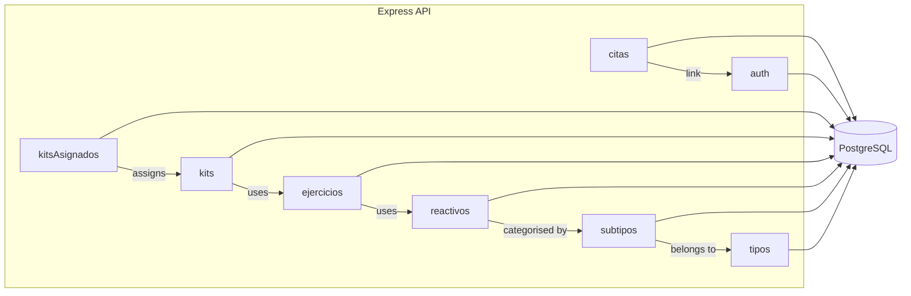
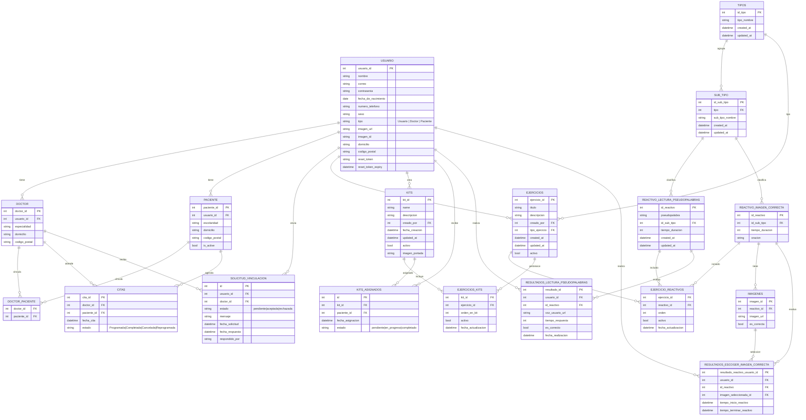

# System diagrams for lexyboz_backend

Below are two Mermaid diagrams you can view directly in GitHub or VS Code Markdown Preview.

## High-level module view

## Entity-Relationship (ER) diagram

Notes:
- Some column names may vary slightly in your DB; this reflects what the code references today.
- Table and relationship names are uppercased here for readability; your physical names use snake_case.
- If you want PNG/SVG export, you can use the Mermaid CLI or VS Code Mermaid extension to render.
